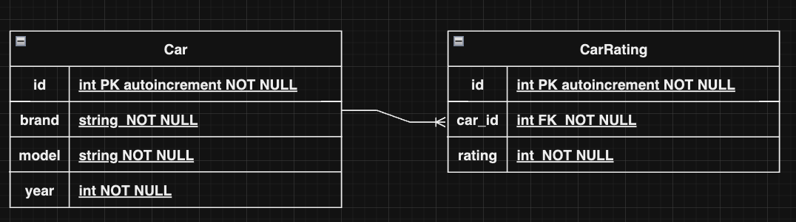

# Car Rating API

## Installation
### 1. Clone the repository
```python 
git clone https://github.com/Sebastvin/fastapi-cars
cd fastapi-cars
```

### 2. Create a virtual environment and activate it
```python 
python -m venv venv
```

### 3. Create a virtual environment
```python 
pip install -r requirements.txt
```

### 4. Start server
```python 
uvicorn main:app --reload
```

## API Endpoints
`GET /cars/` <b>Add all cars from DB</b>

`POST /cars/` <b>Add a new car</b>

`POST /cars/{car_id}/rate` <b>Rate a car</b>

`GET /cars/top10` <b>Get top 10 rated cars</b>

## Diagram of Entity-Relationship
